# Proyecto 1 — Imagen Docker

API REST de productos (Node.js + Express) empaquetada en una imagen Docker propia.

## Descripción

Una tienda virtual necesita exponer una API REST de productos que pueda ejecutarse en cualquier computador sin instalar Node.js. Esta solución empaqueta la API en una imagen Docker propia (`tienda-api:1.0`), construida sobre `node:20-alpine`, con los datos de productos almacenados en memoria y cinco endpoints CRUD.

## Requisitos

- Docker

## Instrucciones de ejecución

1. Clonar el repositorio.
2. Construir la imagen:
   ```
   docker build -t tienda-api:1.0 .
   ```
3. Ejecutar el contenedor en segundo plano, publicado en el puerto 3000:
   ```
   docker run -d --name tienda-api -p 3000:3000 tienda-api:1.0
   ```
4. Verificar que está corriendo:
   ```
   docker ps
   ```
5. Ver los logs:
   ```
   docker logs tienda-api
   ```
6. Detener y eliminar el contenedor:
   ```
   docker stop tienda-api
   docker rm tienda-api
   ```

## Endpoints

| Método | Ruta              | Descripción                  |
|--------|-------------------|-------------------------------|
| GET    | /products         | Listar todos los productos    |
| GET    | /products/:id     | Obtener un producto por id    |
| POST   | /products         | Crear un producto             |
| PUT    | /products/:id     | Actualizar un producto        |
| DELETE | /products/:id     | Eliminar un producto          |

Ejemplo de creación:
```
curl -X POST http://localhost:3000/products -H "Content-Type: application/json" -d "{\"name\":\"Monitor\",\"price\":500000}"
```

## CI/CD

El repositorio incluye un workflow de GitHub Actions (`.github/workflows/ci.yml`) que instala las dependencias y construye la imagen Docker automáticamente en cada `push` o `pull request` a `main`.

## Evidencias

### Creación del repositorio y configuración del entorno
Se crea el repositorio en GitHub y se habilita la ejecución de scripts en PowerShell (`Set-ExecutionPolicy`) para poder usar `npm`.

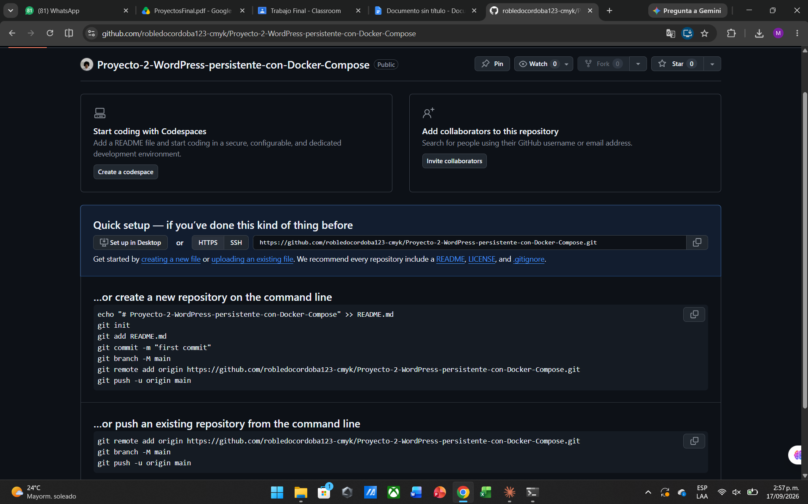
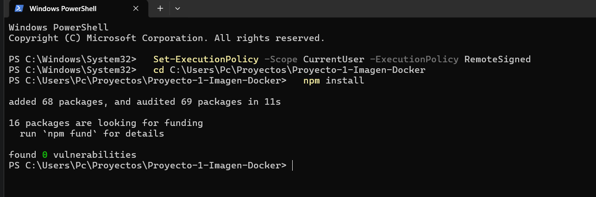

### Primer commit del código de la API
Se agrega el código fuente de la API en Express y se confirma que el servidor arranca correctamente en el puerto 3000.

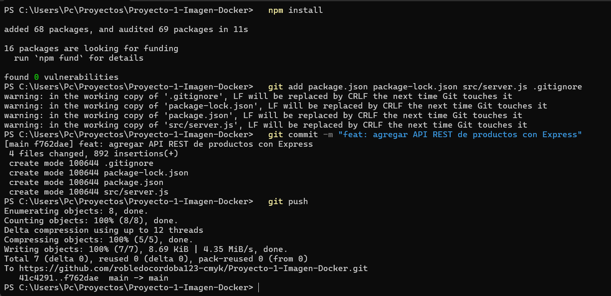
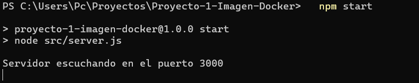

### Dockerfile y construcción de la imagen
Se agrega el `Dockerfile` y `.dockerignore`, y se construye la imagen `tienda-api:1.0` con éxito.

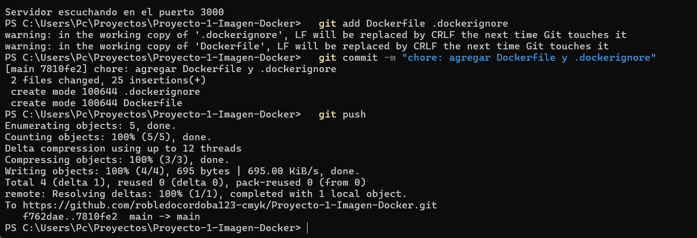
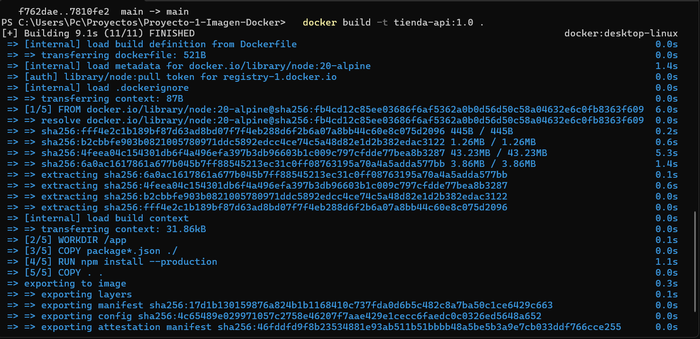

### Resolución de conflictos de puerto durante las pruebas
Al ejecutar el contenedor se detectó que el puerto 3000 ya estaba en uso por otro contenedor de una máquina distinta; se identifica y detiene el contenedor en conflicto para liberar el puerto.

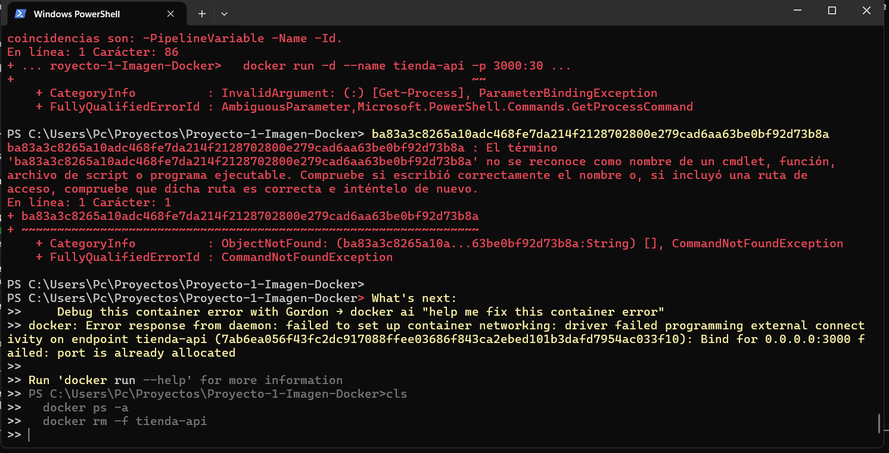
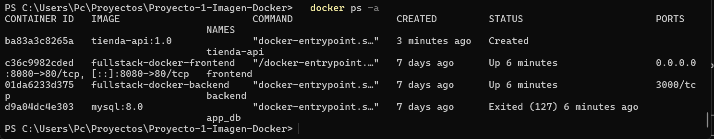
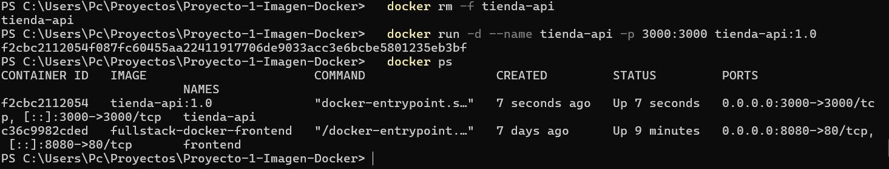
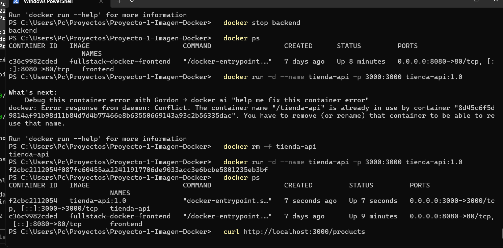

### Contenedor en ejecución
Con el puerto liberado, el contenedor `tienda-api` queda corriendo correctamente y publicado en el puerto 3000 de la máquina.

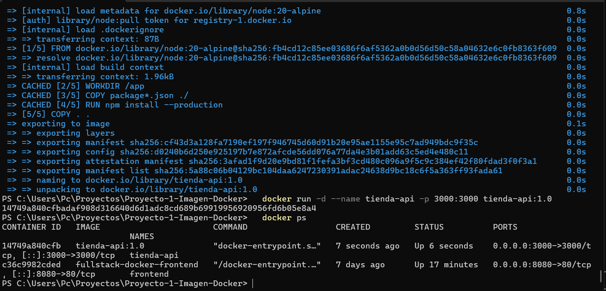

### Pruebas de los 5 endpoints CRUD
Se prueban los 5 endpoints (`GET /products`, `GET /products/:id`, `POST`, `PUT`, `DELETE`) con `curl`, obteniendo los códigos de estado esperados (200, 201, 204).

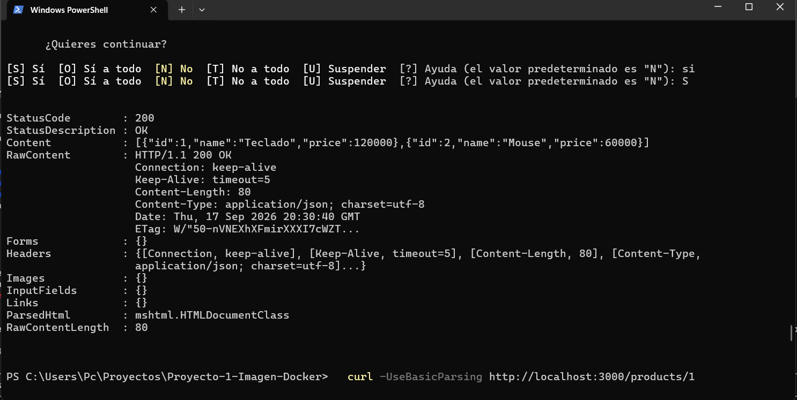
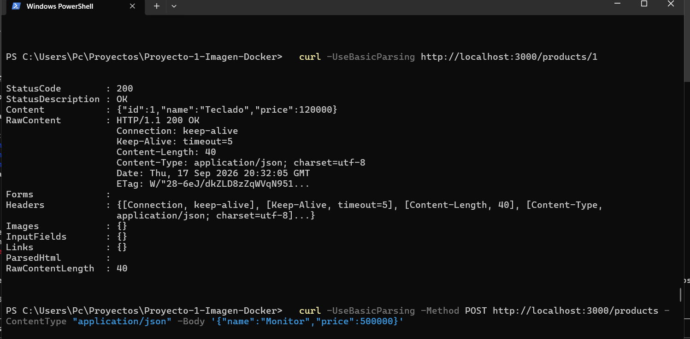
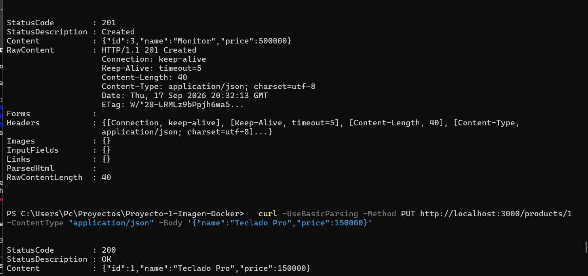
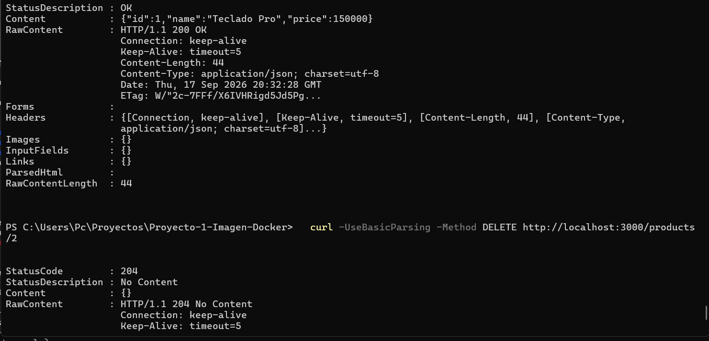


### Logs del contenedor y pipeline CI/CD
Se revisan los logs del contenedor y se agrega el workflow de GitHub Actions que construye la imagen automáticamente.

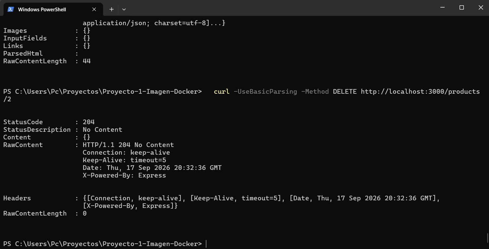
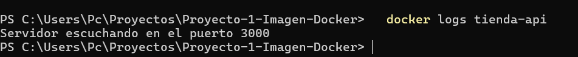

### Flujo de Pull Request
Se crea una rama corta (`docs/agregar-autor`), se abre un Pull Request hacia `main`, el pipeline de CI se ejecuta automáticamente sobre el PR y, tras verificar que pasa, se fusiona.

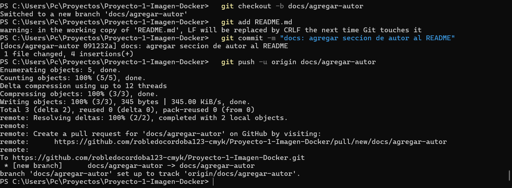
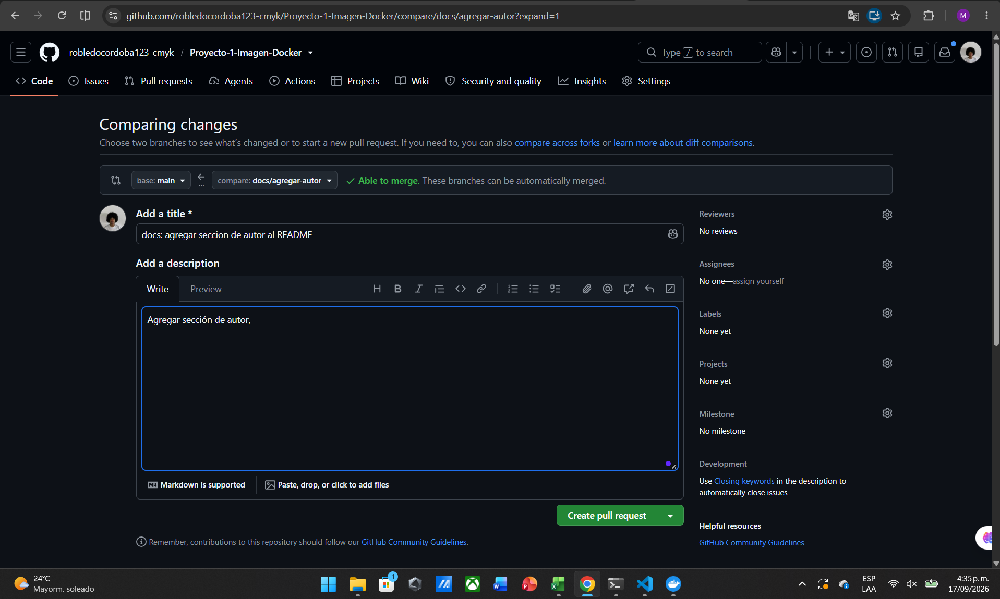
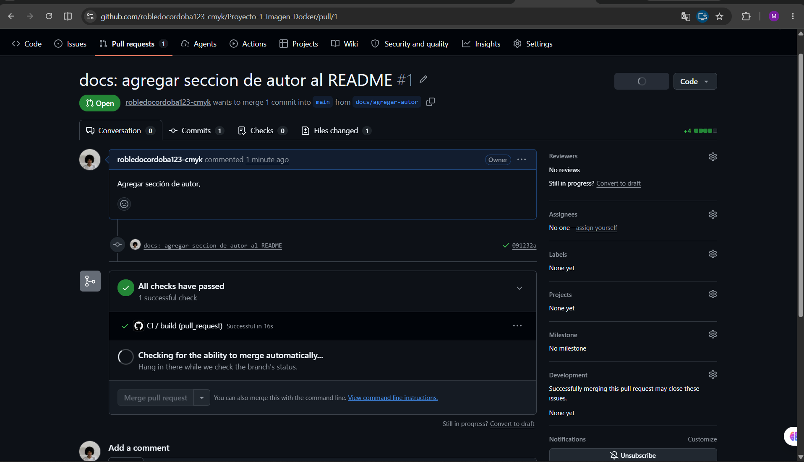
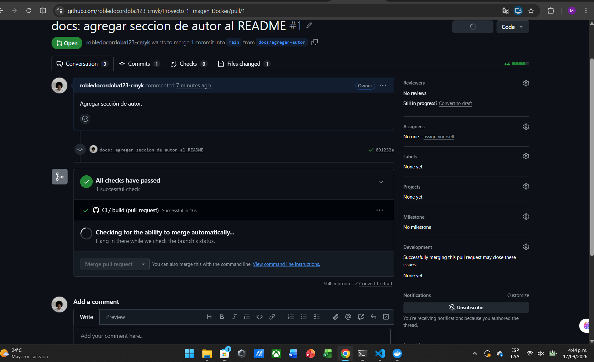
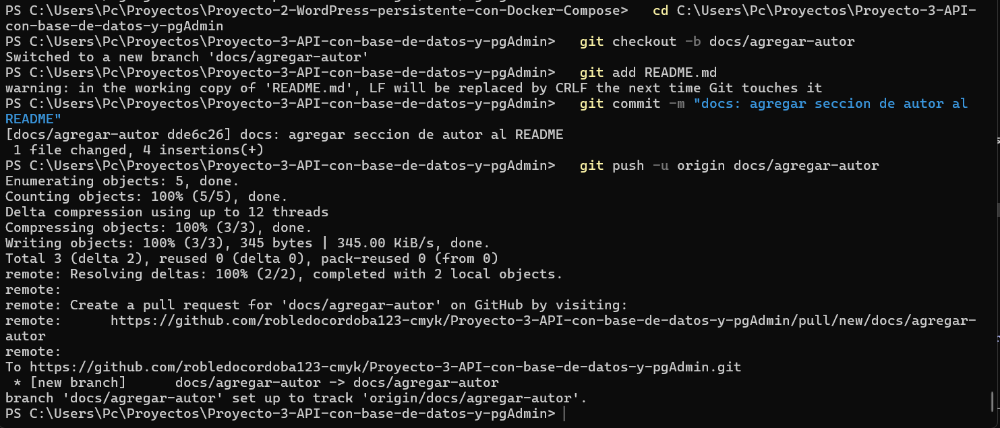
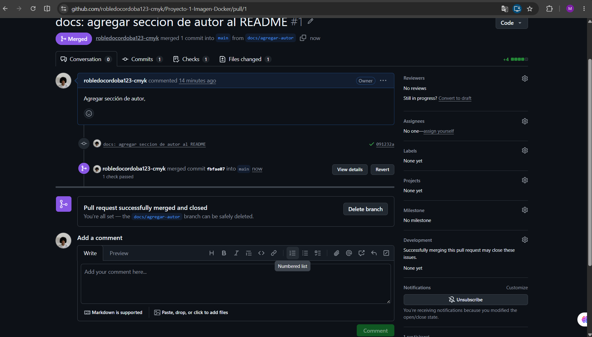

## Autor

Manuela Cordoba
